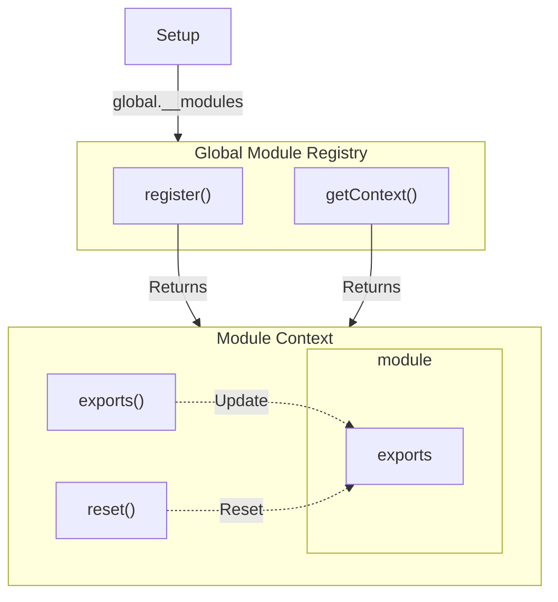

# Specification

## Diagram

```mermaid
flowchart TD
    Setup --> |global.__modules| Registry

    subgraph Registry["Global Module Registry"]
    Reg["register()"]
    Get["getContext()"]
    end

    subgraph Context["Module Context"]
    direction LR
    Exp["exports()"]
    Rst["reset()"]

        subgraph Module["module"]
        Exports["exports"]
        end

    Exp -. Update .-> Exports
    Rst -. Reset .-> Exports
    end

    Reg -- Returns --> Context
    Get -- Returns --> Context
```

## Context

