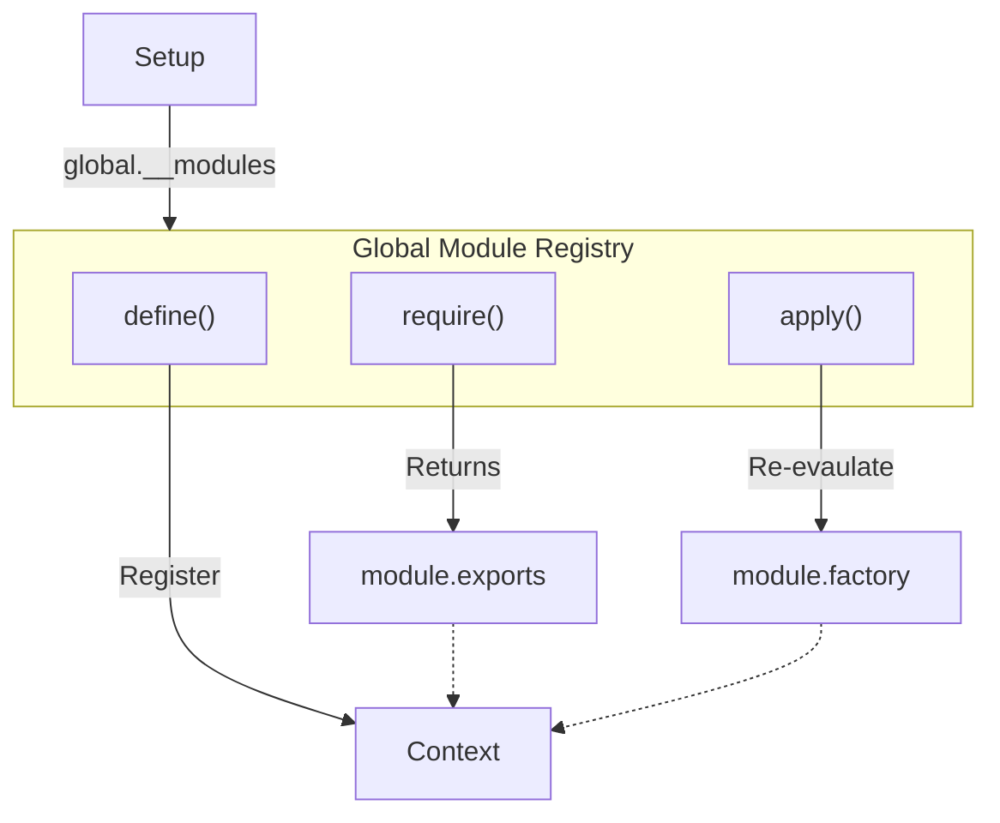
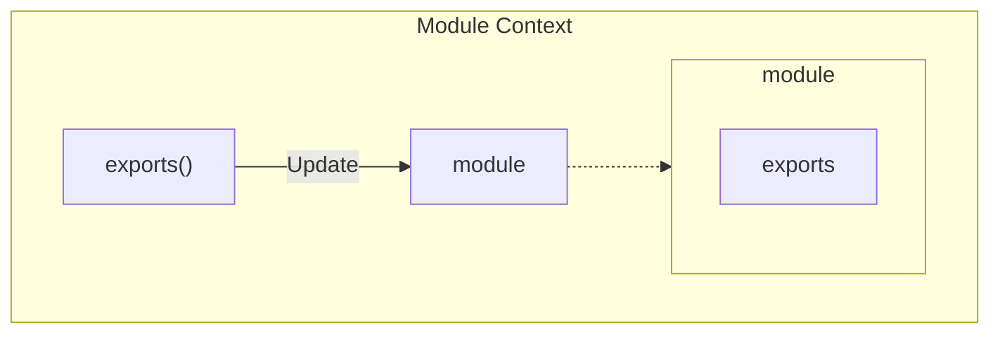

# Specification

Update needed

## Global Module Registry



Global module registry is a map of module id to module.

The `define()` method, register a module context. (If the module is already registered, it will override existing context)

```js
global.__modules.define(factory, 'id', deps);
```

The `require()` method, which will return the exports object in the module context. (If the module is not registered, it will throw an error.)

```js
const exports = global.__modules.require('id');
```

The `apply()` method, which will re-evaulate the specific module's factory.
If the module's dependencies are updated, you can use this method to re-evaulate the module.

```js
global.__modules.apply('id', depsMap);
```

## Module Context



A module context is an object that contains the exports object.

The context has two methods:

- `exports(definitions)` - This is the function that you use to define the exports of the module.
  ```js
  // - ESM: `export { foo, bar };`
  // - CommonJS
  //   - `module.exports = { foo, bar };`
  //   - `exports.foo = foo;`
  //   - `exports.bar = bar;`
  context.exports(function () {
    return {
      foo,
      bar,
    };
  });
  ```
  - `exports.ns(exports)` - This is the helper function that you use to convert the exports of the module to the namespace exports (exclude the **default export**).
    ```js
    context.exports(function () {
      return {
        // eg. If you want to re-export all of other modules,
        // you can use this for exclude the default export.
        //
        // Likely, `export * from 'mod';`
        ...context.exports.ns(mod),
      };
    });
    ```

and context has a property:

- `module` - This is the module object that you are registering.
- `module.exports` - This is the exports object of the module. you can access exported values defined by `exports(definitions)`.

  ```js
  // CommonJS
  context.module.exports.foo = 1;
  context.module.exports.bar = 2;

  // or export the module itself
  context.module.exports = 'default';
  ```
